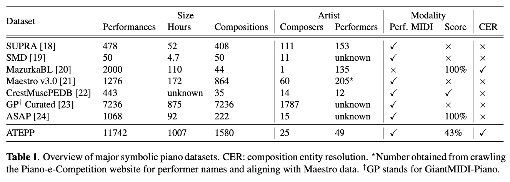
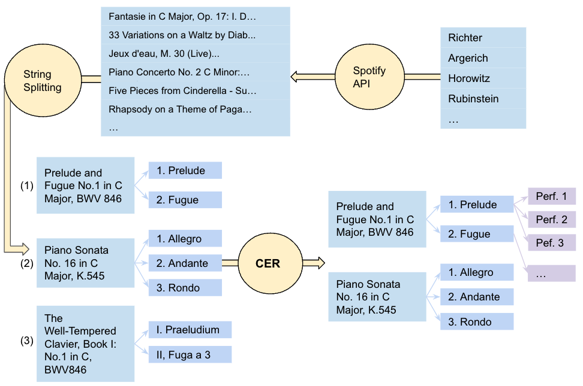
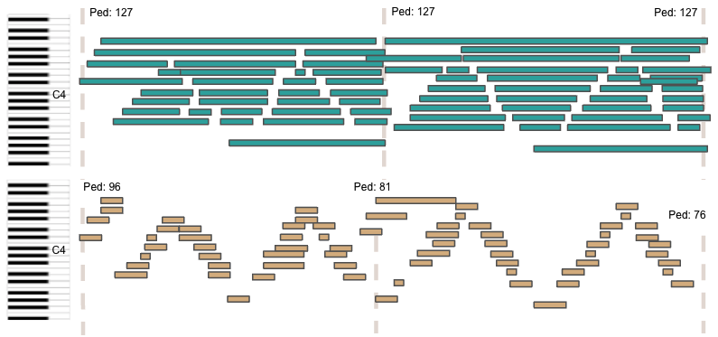
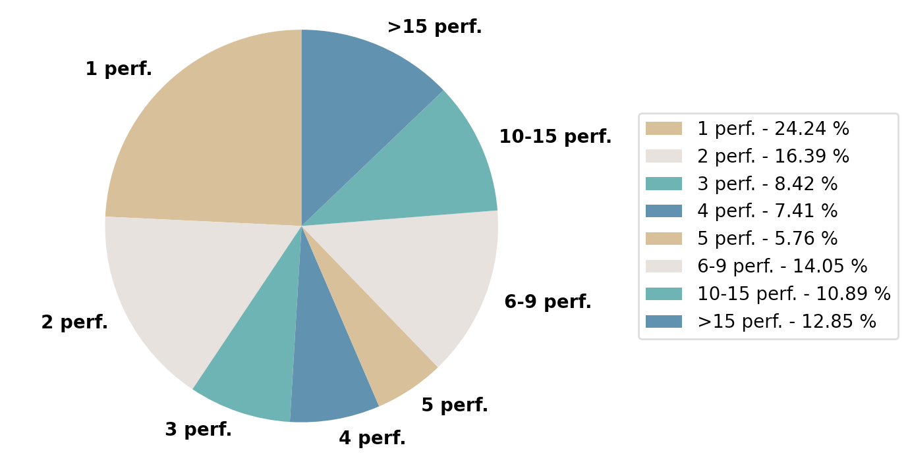

# ATEPP: A Dataset of Automatically Transcribed Expressive Piano Performance


NOTE: We released a cleaned version of our dataset. Please check the <a href="https://github.com/tangjjbetsy/ATEPP#version-12-latest-release">ATEPP-1.2</a> on github for more details. The following introduces the first release of the dataset. 

## Abstract
Computational models of expressive piano performance rely on attributes like tempo, timing, dynamics and pedalling. Despite some promising models for performance assessment and performance rendering, results are limited by the scale, breadth and uniformity of existing datasets. In this paper, we present ATEPP, a dataset that contains 1000 hours of performances of standard piano repertoire by 49 world-renowned pianists, organized and aligned by compositions and movements for comparative studies. Scores in MusicXML format are also available for around half of the tracks. We first evaluate and verify the use of transcribed MIDI for representing expressive performance with a listening evaluation that involves recent transcription models. Then, the process of sourcing and curating the dataset is outlined, including composition entity resolution and a pipeline for audio matching and solo filtering. Finally, we conduct baseline experiments for performer identification and performance rendering on our dataset, demonstrating its potential in generalizing expressive features of individual performing style.

**Main Contributions**:

- We performed an error analysis for piano performance transcription, comparing state-of-the-art models and verifying the reliability of transcribed performances with listening tests.
- We focus on Western classical piano music and release a dataset with sufficient richness and variety for studying expressiveness and styles across different performers.
- Our released dataset is a performer-oriented dataset that consists of 11742 virtuoso recordings with 1007 hours of music.

## Dataset Overview
The non-trivial task of Composition Entity Resolution (CER), involving the process of automatically aligning the complex naming schemes of classical music, is the major challenge of obtaining multiple performances of the same music at a larger scale. We developed a [composition entity linker](https://github.com/anusfoil/Composition-Entity-Linker) to address this challenge.

 

 

## Data Curation Pipeline

 

 

## Transcription Model
With the goal of reconciling the sustain effect from both pedal and keys, as well as achieving more accurate note offsets, we modify the original [High-Resolution model](https://github.com/bytedance/piano_transcription) with joint note-pedal training. As shown in Figure 1, what we model is the key action from the pianist instead of the string damping time of the note (that can either come from the sustain pedal or key action), which deviates from the traditional transcription task.

 
 <b>Figure 1:</b> Output pianoroll comparison of the original
High-Resolution model (top) and joint note-pedal version
(bottom)

 

## Statistics

 
 <b>Figure 2:</b> Distribution of movements by number of performances. E.g. 12% of our data have more than 15 performances

 

 
 <b>Figure 3:</b> Distribution of the top 25 pianists’ performances in the ATEPP dataset.

 



